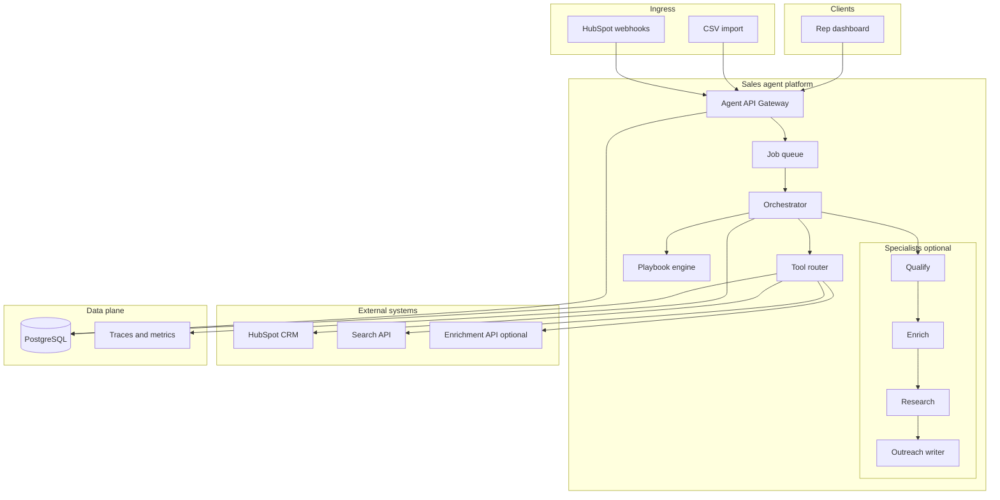

# System Blueprint — Revenue & Sales Operations Agent

## 1. Vision

Deliver **instant, personalized, governed** inbound lead follow-up by combining **ICP qualification**, **structured enrichment**, **cited web research**, and **allowlisted HubSpot actions**—comparable in spirit to **Salesforce Agentforce** / **HubSpot Breeze** at a **portfolio-pilot** scope, with **human approval** on customer-facing outreach.

---

## 2. Design principles

1. **No outreach without approval (MVP)** — Drafts only; sends are a gated phase with extra eval.  
2. **Playbook before model** — ICP fit, stage rules, and send caps enforced in code.  
3. **Cited or cautious** — Research claims must link to sources or downgrade copy to generic value prop.  
4. **Idempotent CRM writes** — Stable keys per lead run + tool name; safe webhook retries.  
5. **Observable runs** — Every lead has a replayable timeline: qualify → tools → draft → approval → CRM.  
6. **Ship with evals** — No CRM stage automation until golden-lead metrics pass.  

---

## 3. Logical architecture



---

## 4. Orchestration loop

| Step | Component | Output |
|------|-----------|--------|
| 1 | Ingest normalize | `lead_id`, dedupe by email + portal |
| 2 | Playbook pre-check | Opt-out / blocklist |
| 3 | Qualification | `qualified` + reasons + score |
| 4 | Enrichment | Firmographics JSON + provider metadata |
| 5 | Research | People + angles + `sources[]` |
| 6 | Draft outreach | Subject, body, personalization tokens |
| 7 | Quality gate | Block draft if missing required fields or failed citation policy |
| 8 | Approval queue | Human decision |
| 9 | CRM commit | Notes, properties, stage (if approved) |

**Modes**

- **Shadow:** Steps 1–7 run; **no** HubSpot mutations; dashboard shows “what would happen.”  
- **Pilot:** CRM writes after approval; still no direct email send API in MVP.  

---

## 5. Tool catalog (v1)

| Tool | Type | Preconditions | Side effects |
|------|------|---------------|--------------|
| `hubspot_get_contact` | Read | OAuth valid | None |
| `hubspot_upsert_contact` | Write | Qualified or manager override | Contact create/update |
| `hubspot_create_note` | Write | Approved draft or shadow | Timeline note |
| `hubspot_update_deal_stage` | Write | Approved + stage rule pass | Pipeline move |
| `enrich_company` | Read | — | External API call |
| `web_search` | Read | Rate limit | Search API call |
| `log_disqualified` | Write | Disqualified | Tag + audit only |

---

## 6. Playbook engine (examples)

Rules are **versioned YAML** (not prompt-only):

```yaml
icp:
  employee_count_min: 50
  employee_count_max: 500
  allowed_countries: [US, GB, DE]
  blocked_industries: [gambling, adult]

outreach:
  max_drafts_per_lead_per_day: 2
  required_citations_min: 1
  tone: consultative

pipeline:
  on_approve_first_touch:
    deal_stage_id: "attempting_contact"
  require_approval_for_stage_change: true
```

---

## 7. Evaluation & safety

| Layer | Mechanism |
|-------|-----------|
| Golden leads | Expected qualify yes/no, tool args, forbidden phrases |
| Regression CI | Block merge if pass rate drops |
| Red team | Prompt injection via form fields; PII exfil attempts |
| Kill switch | Pause queue consumer per org |

See future `docs/EVALUATION_AND_SAFETY.md` (clone from ops agent and adapt).

---

## 8. Phase decisions (ADRs summary)

| Decision | Choice | Alternative rejected |
|----------|--------|---------------------|
| CRM v1 | HubSpot | Salesforce (heavier OAuth + object model for MVP) |
| Send path | Approval + note/draft only | Auto-send (reputation risk) |
| Orchestration | LangGraph or explicit FSM | Single monolithic prompt |
| Tenancy | Single org demo → multi-org in R4 | Full multi-tenant day one |

---

## 9. Related documents

- [Comprehensive roadmap](./COMPREHENSIVE_ROADMAP.md) — phases R0–R5 and deliverable checklist  
- README — hiring manager skim and doc index  
