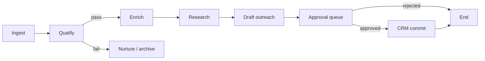
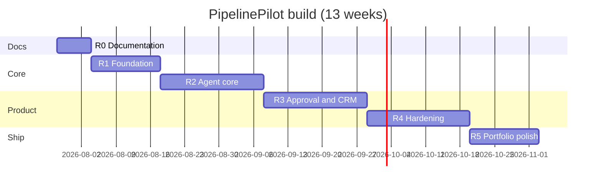

# Comprehensive Roadmap — Revenue & Sales Operations Agent

**Codename:** PipelinePilot (rename freely)  
**Author:** [Your name]  
**Last updated:** July 2026  
**Audience:** You (build plan) + hiring managers (portfolio narrative)

This document is the **single source of truth** for what to build, in what order, and how the ten standard deliverables fit together. It mirrors the structure of your **Operations & Customer Service** and **BI multi-agent** portfolio projects so recruiters see a consistent engineering story.

---

## 0. Current state check

| Item | Status |
|------|--------|
| Repo / code | **Empty** — greenfield |
| Sibling reference implementations | Ops agent (~v0.6 pilot), BI agent (E0–E6 complete) |
| Recommended reuse | Monorepo layout, Docker Postgres, eval package pattern, shadow → auto phasing, `docs/` index in README |

**Portfolio goal:** Ship a **demoable, forkable** system that proves you can design **agentic sales automation** with **CRM integrations**, **governance**, and **metrics**—not a prompt-only email generator.

---

## 1. PRD — What we are building (requirements snapshot)

Full PRD will live in `docs/PRD.md`. Below is the **non-negotiable requirement set** for implementation—no guessing.

### 1.1 Problem

Sales reps spend ~**70%** of time on non-selling work: CRM hygiene, lead research, and drafting outreach. Inbound leads cool off; **speed-to-lead** and **personalization** rarely scale together.

### 1.2 Product summary

A **sales operations agent platform** that:

1. **Ingests** new leads from HubSpot (webhooks + optional CSV)
2. **Qualifies** against a configurable ICP playbook (rules + LLM assist)
3. **Enriches** company/person data from structured APIs and **public web research** (with source citations)
4. **Drafts** hyper-personalized first-touch email (and optional follow-up sequence outline)
5. **Queues** drafts for **rep or manager approval** before any send
6. **Updates** HubSpot (contact properties, notes, deal stage) via allowlisted tools
7. **Measures** time-to-first-touch, approval rate, and pipeline movement

### 1.3 Personas

| Persona | Needs |
|---------|--------|
| **SDR / AE** | Fast context, editable drafts, one-click approve, no surprise CRM changes |
| **Sales manager** | Queue visibility, playbook tuning, team KPIs, kill switch |
| **RevOps** | HubSpot mapping, stage rules, audit export, eval regression |
| **Prospect (indirect)** | Relevant, non-spam outreach; honor opt-out |

### 1.4 Functional requirements (P0)

| ID | Requirement | Acceptance (pilot) |
|----|-------------|-------------------|
| FR-1 | HubSpot OAuth + webhook ingest for new contacts/deals | New lead triggers agent run within 60s |
| FR-2 | ICP qualification | Disqualified leads get reason + optional nurture tag; no outreach draft |
| FR-3 | Enrichment | Company size, industry, tech signals (where available), linked sources |
| FR-4 | Decision-maker research | At least 1 relevant role + public profile/link or “insufficient data” |
| FR-5 | Email draft | Subject + body; references enrichment; tone from playbook |
| FR-6 | Approval workflow | States: `draft` → `approved` / `rejected` / `edited`; actor + timestamp |
| FR-7 | CRM writes | Notes, custom properties, deal stage—**only** after rules pass |
| FR-8 | Audit | 100% of tool calls and approvals logged |
| FR-9 | Admin dashboard | Lead queue, run status, errors, KPI tiles |

### 1.5 Non-goals (PRD explicit)

- Replacing HubSpot/Salesforce UI or full CPQ
- **Autonomous send** without human approval in MVP
- LinkedIn automation / scraping behind login walls
- Cold calling or dialer integration in v1
- Multi-language sequences in v1
- Guaranteed email deliverability (SPF/DKIM setup is customer infra)

### 1.6 Success metrics (90-day pilot)

| Metric | Target |
|--------|--------|
| Median time from ingest → draft ready | **< 5 min** |
| Enrichment coverage (qualified leads) | **≥ 85%** |
| Draft approved without major edit | **≥ 70%** |
| Critical errors on golden-lead eval | **< 2%** |
| Unapproved sends | **0** |

---

## 2. TRD — Technical requirements (under the hood)

Full doc: `docs/TRD.md`. Summary for roadmap alignment.

### 2.1 Tech stack (recommended — matches portfolio)

| Layer | Choice | Rationale |
|-------|--------|-----------|
| Rep dashboard | **Next.js 15** (App Router) | Same as ops widget; employer-familiar |
| Agent API | **FastAPI** (Python 3.12) | Tool calling, eval, policy engine in Python |
| Orchestration | **LangGraph** or custom state machine | Proven in BI agent; clear phases |
| LLM | OpenAI / Anthropic (tool calling) | Structured outputs for CRM payloads |
| DB | **PostgreSQL 16** | Leads, runs, approvals, audit |
| Queue | **Redis** or Postgres job table | Webhook → async agent runs |
| Vector (optional v1.1) | pgvector | Playbook + battlecard RAG |
| Observability | OpenTelemetry + structured logs | Trace per `lead_run_id` |
| Hosting | Docker Compose local; **Vercel** (UI) + **Railway/Fly** (API) demo |

### 2.2 External APIs

| System | MVP | Later |
|--------|-----|-------|
| **HubSpot** | OAuth 2.0, CRM v3, webhooks | Sequences API (if approved sends) |
| Enrichment | Mock + optional **Clearbit/Apollo** env | Pluggable provider interface |
| Web research | **Tavily / Brave / Serper** search API | — |
| Email send | **None in MVP** (copy-to-clipboard or HubSpot draft only) | Resend/HubSpot send with approval token |
| Calendar | — | Cal.com / HubSpot meetings (v1.2) |
| Billing (product) | Stripe Checkout (if SaaS demo) | Usage metering |

### 2.3 Authentication & authorization

- **Dashboard:** Magic link or Clerk/Auth.js; org-scoped JWT
- **HubSpot:** Per-org OAuth refresh tokens encrypted at rest (AES-GCM or KMS in prod story)
- **API keys:** Service-to-service for webhooks (signed HubSpot payloads)
- **RBAC:** `rep`, `manager`, `admin`, `viewer` — see schema section

### 2.4 Agent architecture



**Policy engine (code, not prompt):** max emails/day per rep, required fields before stage advance, blocked domains, opt-out list.

### 2.5 Security & compliance

- PII minimization in logs; redact email bodies in traces by default
- Webhook signature verification
- Rate limits per org
- CAN-SPAM / GDPR narrative in docs (lawful basis = customer’s sales outreach program)

---

## 3. MVP — Version 1 scope

Full doc: `docs/MVP.md`.

### 3.1 MVP **is**

- Single-tenant demo org + one HubSpot sandbox portal
- Lead ingest → qualify → enrich → research → draft → **approval UI**
- HubSpot: create/update contact, add note, move deal to **one** configured stage (e.g. “Attempting contact”)
- Golden-lead eval (30–50 scenarios) in CI
- Docker Compose: Postgres + API + web
- Manager KPI page: queue depth, median time-to-draft, approval rate

### 3.2 MVP **is not**

- Salesforce connector
- Auto-send email
- Multi-org SaaS billing (optional stub only)
- Quote/PDF generation
- LinkedIn actions
- Mobile app

### 3.3 Feature freeze rule

No new intents/tools until eval pass rate and approval UX are stable for **2 weeks**.

---

## 4. User flows — Every journey

Full doc: `docs/USER_FLOWS.md`. Critical paths (no dead ends):

| Flow | Steps | Dead-end prevention |
|------|-------|---------------------|
| **Connect HubSpot** | Settings → OAuth → test webhook → success or retry with error code | Link to troubleshooting doc |
| **New lead** | Webhook → processing card → draft ready notification | Failed run → “Retry” + support id |
| **Rep review** | Queue → open lead → see enrichment sources → edit draft → approve/reject | Reject requires reason; returns to manager metrics |
| **CRM sync** | Approve → async HubSpot write → success badge or actionable error | Failed write → do not mark sent; rollback state |
| **Disqualified lead** | Show ICP reason → optional manual override (manager) | Override audited |
| **Onboarding** | Empty state → import CSV sample → first run walkthrough | Sample data kit in repo |

---

## 5. Design system

Full doc: `docs/DESIGN_SYSTEM.md`.

**Direction:** Professional RevOps dashboard (not consumer chat). Align with ops agent tokens for portfolio consistency.

| Token | Value |
|-------|--------|
| Font | **Inter** (UI), **JetBrains Mono** (IDs, JSON) |
| Primary | `#2563EB` (actions) |
| Success | `#059669` |
| Warning | `#D97706` |
| Danger | `#DC2626` |
| Surface | `#F8FAFC` / dark `#0F172A` optional |
| Components | Data table, lead detail drawer, approval bar, timeline (agent steps), source citation chips, KPI stat cards |
| Buttons | Primary (approve), Secondary (edit), Ghost (reject), Destructive (kill run) |

---

## 6. Database schema

Full doc: `docs/DATABASE_SCHEMA.md`.

### 6.1 Core entities

```text
organizations ─┬─ users (membership, role)
                 ├─ hubspot_connections (tokens, portal_id)
                 ├─ playbooks (ICP rules, tone, stage map)
                 ├─ leads (external_id, email, company, status)
                 ├─ lead_runs (orchestration state, model, trace_id)
                 ├─ enrichments (jsonb, sources[])
                 ├─ outreach_drafts (subject, body, version)
                 ├─ approvals (decision, user_id, diff)
                 ├─ tool_runs (tool_name, request, response, idempotency_key)
                 ├─ audit_events (actor, action, payload)
                 └─ opt_outs (email/domain)
```

### 6.2 Permissions matrix

| Action | rep | manager | admin | viewer |
|--------|-----|---------|-------|--------|
| View queue | own + unassigned | team | all | read |
| Approve send | own | team | all | — |
| Edit playbook | — | yes | yes | — |
| Connect HubSpot | — | — | yes | — |
| Export audit | — | yes | yes | — |

---

## 7. Monetization plan

Full doc: `docs/MONETIZATION.md`.

**Portfolio framing:** Show you understand **SaaS + ROI**, even if v1 is not billed.

| Model | Details |
|-------|---------|
| **Tier 1 — Starter** | $49/user/mo — 1 portal, 500 agent runs/mo |
| **Tier 2 — Team** | $99/user/mo — approvals, manager dashboard, 2k runs |
| **Tier 3 — Enterprise** | Custom — SSO, Salesforce, SLA, dedicated VPC story |
| **Usage overage** | $0.05 per agent run (enrich + research + draft) |
| **Marketplace (future)** | Playbook packs (vertical ICP templates) — 70/30 split |

**ROI slide for interviews:** If 200 inbound leads/mo and 15 min saved per lead at $45/hr loaded cost → ~**$2,250/mo** labor savings vs **~$500** software.

---

## 8. Launch plan

Full doc: `docs/LAUNCH_PLAN.md`.

| Phase | Who | What |
|-------|-----|------|
| **Alpha** | You + 1 friendly rep | Shadow only: agent runs, no CRM writes |
| **Beta** | 3–5 design partners | CRM writes + approval; weekly feedback |
| **Pilot** | One real team (5 reps) | KPI review at day 30/60/90 |
| **Launch day** | Public GitHub + Loom | README, live demo on sandbox HubSpot, blog post |
| **Distribution** | — | Docker pull, one-click deploy docs, `.env.example` |

**Rollback:** Feature flag `crm_writes_enabled`; kill switch stops queue consumption.

---

## 9. User acquisition — First 100 users

Full doc: `docs/USER_ACQUISITION.md`.

| Channel | Tactic |
|---------|--------|
| **Design partners** | RevOps Slack communities, HubSpot partner forums |
| **Content** | “Speed-to-lead agent architecture” technical post + diagram |
| **Open source** | MIT core + paid cloud (optional) |
| **LinkedIn** | Short series: shadow mode → approval → metrics |
| **Portfolio** | Pin repo; 8-min Loom for recruiters |

**First 100 definition:** GitHub stars + demo signups + 10 active weekly sandbox users (track honestly in README).

---

## 10. Growth plan

Full doc: `docs/GROWTH_PLAN.md`.

- **Case study:** Before/after median time-to-first-touch (anonymized)
- **Integrations page:** HubSpot certified app narrative (even if not submitted yet)
- **Reviews:** G2/Capterra-style quotes from design partners (with permission)
- **Eval benchmark:** Publish golden-lead score methodology (credibility)
- **Conference talk angle:** “Human-in-the-loop outbound agents”

---

## 11. Implementation phases (build order)

This is the **engineering roadmap** tied to employer showcase milestones.

| Phase | Name | Duration | Exit criteria | Hiring signal |
|-------|------|----------|---------------|---------------|
| **R0** | Docs + repo skeleton | Week 1 | PRD, TRD, MVP, flows, schema, design tokens committed; CI stub | Product thinking |
| **R1** | Foundation | Weeks 2–3 | Monorepo, Postgres migrations, HubSpot OAuth mock, webhook receiver | Backend hygiene |
| **R2** | Agent core | Weeks 4–6 | Qualify → enrich → research → draft; tool router; 30 golden scenarios ≥80% | LLM systems |
| **R3** | Approval + CRM | Weeks 7–9 | Dashboard queue; HubSpot writes; audit; idempotency | Integrations |
| **R4** | Pilot hardening | Weeks 10–12 | OTel traces, rate limits, eval CI gate, Docker one-command up | Production mindset |
| **R5** | Portfolio polish | Week 13+ | Loom, INTERVIEW_GUIDE, live demo, optional Stripe stub | Job search ready |



---

## 12. Parity with your other portfolio agents

| Pattern (Ops / BI) | Sales agent equivalent |
|--------------------|-------------------------|
| Policy engine | ICP + stage transition rules |
| Verification gate | HubSpot OAuth + org scope |
| Shadow mode | Agent runs without CRM write / without send |
| Golden eval | Golden **leads** (qualify, draft quality, tool args) |
| Admin metrics | RevOps KPI dashboard |
| Feature flags | `auto_enrich`, `crm_writes`, `research_enabled` |

---

## 13. Risks & mitigations

| Risk | Mitigation |
|------|------------|
| HubSpot API limits | Batch reads; cache; queue backoff |
| Poor research quality | Require citations; “insufficient data” path; no fabrication in eval |
| Spam/reputation damage | No auto-send MVP; caps; opt-out table |
| “Just ChatGPT emails” | Emphasize tools, audit, eval, CRM side-effects in README and demo |
| Scope creep (Salesforce) | Explicit phase **R6** backlog, not MVP |

---

## 14. Next actions (this week)

1. Copy **R0 doc templates** from Operations agent `docs/` and rewrite for sales (PRD, TRD, MVP, etc.).
2. Initialize monorepo: `apps/sales-api`, `apps/dashboard`, `packages/playbook_engine`, `packages/eval`.
3. Register HubSpot **developer sandbox** + private app scopes (`crm.objects.contacts`, `crm.objects.deals`, webhooks).
4. Draft **30 golden leads** JSON (qualify yes/no, expected stage, forbidden claims).
5. Record problem statement clip (2 min) for future Loom intro.

---

## 15. Document completion checklist

| # | Deliverable | File | R0 status |
|---|-------------|------|-----------|
| 1 | PRD | `docs/PRD.md` | **Done** |
| 2 | TRD | `docs/TRD.md` | **Done** |
| 3 | MVP | `docs/MVP.md` | **Done** |
| 4 | User flows | `docs/USER_FLOWS.md` | **Done** |
| 5 | Design system | `docs/DESIGN_SYSTEM.md` | **Done** |
| 6 | Database schema | `docs/DATABASE_SCHEMA.md` | **Done** |
| 7 | Monetization | `docs/MONETIZATION.md` | **Done** |
| 8 | Launch plan | `docs/LAUNCH_PLAN.md` | **Done** |
| 9 | User acquisition | `docs/USER_ACQUISITION.md` | **Done** |
| 10 | Growth plan | `docs/GROWTH_PLAN.md` | **Done** |
| — | Blueprint | `docs/BLUEPRINT.md` | **Draft done** |
| — | Master roadmap | `docs/COMPREHENSIVE_ROADMAP.md` | **Done** |

When all R0 files are checked in, tag **`v0.1-spec`** and start **R1** implementation.
